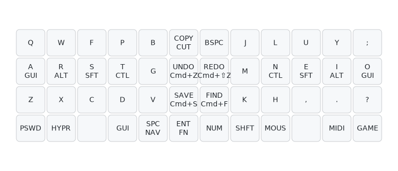
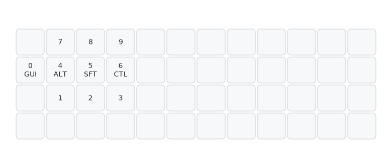

# Planck Rev7 QMK Firmware

> **Personal QMK configuration for Planck Rev7 ortholinear keyboard**
> Featuring urob's bilateral homerow mods, smart behaviors, and comprehensive MIDI support

Adapted from [urob's ZMK config](https://github.com/urob/zmk-config) philosophy for QMK.

[](https://www.gnu.org/licenses/old-licenses/gpl-2.0.en.html)

---

## 🎯 Features

### Inherited from urob's config

- **[Bilateral Homerow Mods](#-bilateral-homerow-mods)** — opposite-hand activation eliminates false triggers
- **[Smart Layers](#-smart-behaviors)** — intelligent layer switching with SMART_NUM, MAGIC_SHIFT
- **[Positional Combos](#-combos)** — urob's fast combo system (18ms) for symbols
- **[Morphs](#-morphs)** — modifier-dependent key behaviors (`,` → `;` → `<`)

### Custom additions

- **[Enhanced MIDI Layer](#midi-enhanced-midi-controller)** — comprehensive Furnace tracker integration
- **[Desktop Management](#-special-behaviors)** — macOS window/desktop controls
- **[Layout Visualization](#-layout-visualization)** — terminal ASCII + professional SVG diagrams
- **[Mac-optimized](#-mac-compatibility)** — Cmd-based shortcuts for productivity

---

## 📊 Layout Overview

**Visual diagrams:**
- **[Complete keymap](draw/planck.svg)** - All 8 layers in one view
- **Individual layers:** [DEF](draw/def-layer.svg) | [NUM](draw/num-layer.svg) | [GAMING](draw/gaming-layer.svg) | [FN](draw/fn-layer.svg) | [SYS](draw/sys-layer.svg) | [NAV](draw/nav-layer.svg) | [MOUSE](draw/mouse-layer.svg) | [MIDI](draw/midi-layer.svg)

**Quick terminal view:**
```bash
make layout          # View all layers in terminal
make layout _DEF     # View specific layer
```

Generates colored ASCII art of keyboard layers - fully functional and fast!

**Regenerate diagrams:**
```bash
make draw           # Generate fresh SVG diagrams
```

See [draw/README.md](draw/README.md) for visualization details.

---

## 🏗️ Architecture

Modular design for maintainability:

```
keymap/
├── keymap.c              # Main keymaps and layer definitions
├── bilateral_mods.h      # Bilateral homerow mod configuration
├── smart_behaviors.h     # SMART_NUM, MAGIC_SHIFT, lt_spc, Alt+Tab swapper
├── combo_system.h        # urob's positional combo system
├── custom_keycodes.h     # Layer definitions and custom keycodes
├── rgb_effects.h         # LED indicators and layer feedback
├── layer_layouts.h       # Layer documentation and visual references
└── midi_enhanced.h       # Enhanced MIDI functionality
```

---

## 🎹 Layers

### DEF (Colemak DH - Default)

Primary typing layer with bilateral homerow mods:



**Features:**
- Colemak DH layout optimized for hand alternation
- Bilateral homerow mods (GUI, Alt, Shift, Ctrl)
- Smart Space (tap: space, hold: NAV layer, shift+tap: dot→space→sticky shift)
- Smart NUM and Magic Shift behaviors
- Middle column productivity shortcuts (Mac-optimized)

### NUM (Numbers with Homerow Mods)

urob-style number layer with homerow mods:



**Examples:**
- Tap `5` → "5"
- Hold `5` + Tap `9` → Shift+9 = "("
- Hold `0` (GUI) + numbers → Cmd+number shortcuts

### GAMING (QWERTY)

Traditional QWERTY for gaming:
- No homerow mods for reliable gaming inputs
- Standard modifier keys
- Toggle with `GAMING` key on base layer

### FN (Function Keys + Media)

Function keys with homerow mods + media controls:
- F1-F12 with mod-tap on F4-F6, F11
- Media controls (play/pause, volume, prev/next)
- Desktop management (switch, pin window/app)
- Mute accessible via FN+NUM position

### NAV (Navigation)

Navigation and window management:
- Arrow keys on NEIO positions
- Page Up/Down, Insert, Tab
- One-shot modifiers (GUI, Alt, Shift, Ctrl)
- Alt+Tab swapper (forward/reverse)
- Backspace and Delete

### SYS (System)

Tri-layer (FN + NUM) for system controls:
- RGB Matrix controls
- Audio/Music/MIDI toggles
- Bootloader access (QK_BOOT)
- EEPROM clear
- Layer switching
- Debug toggle

### MOUSE (Mouse Control)

urob-style mouse layer:
- Mouse movement (arrows)
- Scroll wheel (all directions)
- Mouse buttons (BTN1, BTN2, BTN3)
- Page Up/Down shortcuts

### MIDI (Enhanced MIDI Controller)

Comprehensive MIDI layer for Furnace tracker:
- Chromatic keyboard layout (C-B with sharps)
- Octave controls (±1, ±2, reset)
- Velocity controls (7 levels: PPP to FF, ±adjustments)
- Transpose controls
- Transport (play/pause, record, stop)
- Pattern navigation
- Instrument/channel switching
- Effects (volume, pan, pitch, arpeggio, vibrato, tremolo)
- Sustain and chord mode
- MIDI panic and learn mode

---

## 🤝 Bilateral Homerow Mods

Based on urob's [timeless homerow mods](https://github.com/urob/zmk-config#timeless-homerow-mods):

**Configuration:**
- Tapping term: **280ms** (same as urob)
- Quick tap term: **175ms**
- PERMISSIVE_HOLD enabled for bilateral combinations
- HOLD_ON_OTHER_KEY_PRESS for immediate activation

**Philosophy:**
- Use **opposite hand** for activation → no false triggers
- Example: Hold `A` (left GUI) + Tap `U` (right hand) = Cmd+U
- Same-hand combos still type normally

**Applied to:**
- Base layer: A(GUI), R(ALT), S(SFT), T(CTL) | N(CTL), E(SFT), I(ALT), O(GUI)
- Number layer: 0(GUI), 4(ALT), 5(SFT), 6(CTL)
- Function layer: F11(GUI), F4(ALT), F5(SFT), F6(CTL)

---

## 🎨 Smart Behaviors

### SMART_NUM (urob's smart-num)
- **Tap:** Activate NUM layer momentarily
- **Hold:** Lock NUM layer
- **Tap again:** Release layer

### MAGIC_SHIFT (urob's magic-shift)
- **Tap:** Sticky shift (one-shot)
- **Hold:** Standard shift
- **Double-tap:** Caps Word

### SMART_SPC (urob's lt_spc)
- **Tap:** Space
- **Hold:** NAV layer
- **Shift+Tap:** Dot → Space → Sticky Shift (sentence continuation)

### Alt+Tab Swapper
- **ALT_TAB_FWD:** Forward through windows
- **ALT_TAB_REV:** Reverse direction
- Auto-cancels when other key pressed

---

## 🔤 Morphs

urob's modifier-dependent key behaviors:

| Key | Tap | Shift+Tap | Shift+Ctrl+Tap |
|-----|-----|-----------|----------------|
| `,` | `,` | `;` | `<` |
| `.` | `.` | `:` | `>` |
| `?` | `?` | `!` | — |
| Backspace | BSPC | DEL | — |

Implemented using QMK's Key Override feature.

---

## 🔗 Combos

urob's fast positional combo system (18ms timing):

**Horizontal combos (same row):**
- Adjacent keys: `WF`→`=`, `FP`→`+`, etc.
- Common symbols on home row

**Vertical combos:**
- Bracket pairs, braces
- Programming symbols

See [combo_system.h](keymap/combo_system.h) for complete combo map.

**Configuration:**
- Combo term: **18ms** (urob's fast timing)
- Strict timer enabled
- Combo must hold mods (doesn't interfere with homerow mods)

---

## 🍎 Mac Compatibility

Middle column productivity shortcuts use **Cmd** instead of Ctrl:

| Key | Action | Shortcut |
|-----|--------|----------|
| Row 1 Left | Copy/Cut (tap-dance) | Cmd+C / Cmd+X |
| Row 1 Right | Backspace/Delete | BSPC / Shift→DEL |
| Row 2 Left | Undo | Cmd+Z |
| Row 2 Right | Redo | Cmd+Shift+Z |
| Row 3 Left | Save | Cmd+S |
| Row 3 Right | Find | Cmd+F |

---

## 🎨 Layout Visualization

### Terminal View (Recommended)

Quick, colorful ASCII diagrams right in your terminal:

```bash
make layout           # View all layers
make layout _DEF      # View default layer
make layout _NUM _FN  # View multiple layers
```

Uses `draw_layout.py` for colored ASCII art showing:
- Homerow mods (yellow)
- Special behaviors (cyan)
- Layer structure

Perfect for quick reference while coding!

See [draw/README.md](draw/README.md) for details.

---

## 🔧 Build System

### Requirements
- QMK firmware (included as git submodule)
- `qmk` CLI tool: `brew install qmk/qmk/qmk`

### Setup

```bash
# Clone repository
git clone https://github.com/stphn/planck-layout.git
cd planck-layout

# Initialize QMK submodule
make init-qmk

# Build firmware
make build
```

### Commands

| Command | Description |
|---------|-------------|
| `make build` | Compile firmware to `qmk/.build/planck_rev7_stphn.bin` |
| `make flash` | Build and flash to keyboard (requires bootloader mode) |
| `make save` | Build and archive timestamped firmware to `firmware/` |
| `make clean` | Clean build artifacts |
| `make layout` | View keyboard layouts in terminal |
| `make qmk-status` | Show current QMK version and status |
| `make update-qmk` | Update QMK submodule to latest |

### Flashing

1. Enter bootloader mode:
   - Hold **right thumb** (Enter key position → FN layer)
   - Hold **left thumb** (SMART_NUM → NUM layer)
   - Press **QK_BOOT** (middle column, row 2 on SYS layer)

2. Flash firmware:
   ```bash
   make flash
   ```

---

## 📁 Project Structure

```
.
├── keymap/                 # Main keymap implementation
│   ├── keymap.c           # Core keymaps and logic
│   ├── bilateral_mods.h   # Homerow mod configuration
│   ├── smart_behaviors.h  # Smart layer behaviors
│   ├── combo_system.h     # Combo definitions
│   ├── custom_keycodes.h  # Layer and keycode enums
│   ├── rgb_effects.h      # LED effects
│   ├── layer_layouts.h    # Layer documentation
│   ├── midi_enhanced.h    # MIDI functionality
│   ├── config.h           # QMK feature configuration
│   └── rules.mk           # QMK feature toggles
├── draw/                  # Layout visualization
│   ├── config.yaml        # keymap-drawer config
│   ├── generate.sh        # SVG/PNG generation script
│   └── README.md          # Visualization documentation
├── firmware/              # Archived firmware builds
├── qmk/                   # QMK submodule
├── draw_layout.py         # Terminal ASCII visualization
├── Makefile              # Build automation
└── README.md             # This file
```

---

## 🙏 Credits

- **[urob](https://github.com/urob/zmk-config)** — Bilateral homerow mods, smart behaviors, combos philosophy
- **[caksoylar](https://github.com/caksoylar/keymap-drawer)** — Professional layout visualization tool
- **[QMK Firmware](https://github.com/qmk/qmk_firmware)** — Keyboard firmware framework

---

## 📄 License

GPL-2.0-or-later

---

## 🔗 Related

- **My ZMK config** (Corne): [stphn/zmk-config-urob](https://github.com/stphn/zmk-config-urob)
- **urob's ZMK config**: [urob/zmk-config](https://github.com/urob/zmk-config)
- **QMK Documentation**: [docs.qmk.fm](https://docs.qmk.fm/)
- **Planck Keyboard**: [OLKB](https://olkb.com/collections/planck)
