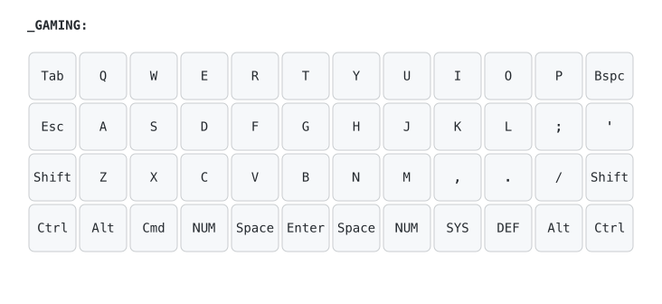

# ⌨️ Planck Rev7 — Personal Layout (Detailed)

This QMK firmware defines multiple layers and custom behaviors for efficient typing and navigation on the Planck Rev7 keyboard. The layout uses Colemak DH as the primary base layer with bilateral homerow mods and smart behaviors.

## 📊 Visual Layout

**Complete keymap:** [All layers SVG](images/keymap.svg) | **Individual layers:** [DEF](images/def-layer.svg) | [NUM](images/num-layer-new.svg) | [GAMING](images/gaming-layer.svg) | [FN](images/fn-layer.svg) | [NAV](images/nav-layer-new.svg) | [SYS](images/sys-layer.svg) | [MIDI](images/midi-layer.svg)

*Generated with [keymap-drawer](https://github.com/caksoylar/keymap-drawer) from [keymap.yaml](keymap.yaml)*

## 🏗 Modular Architecture

The keymap is organized into focused, maintainable modules:
- **[keymap.c](keymap/keymap.c)** (282 lines) - Main keymaps and essential logic
- **[smart_behaviors.h](keymap/smart_behaviors.h)** - SMART_NUM, MAGIC_SHIFT, leader sequences, desktop management
- **[combo_system.h](keymap/combo_system.h)** - Complete urob-style positional combo system
- **[bilateral_mods.h](keymap/bilateral_mods.h)** - Bilateral homerow mod timing configuration
- **[rgb_effects.h](keymap/rgb_effects.h)** - LED group control and layer indicators
- **[custom_keycodes.h](keymap/custom_keycodes.h)** - Layer definitions and keycode enums

## 🎛 Layers

### DEF (Colemak DH - Primary)

The main typing layer featuring:
- Colemak DH key arrangement optimized for hand alternation
- Bilateral homerow mods (Cmd, Alt, Shift, Ctrl)
- Alt on Space hold
- Hyper key (Ctrl+Alt+Shift+GUI) on Enter hold
- F18 key integration for Hammerspoon automation
- Bracket keys `[ ]` on outer corners

### NUM (Numbers)

Number pad layout with 0-9 arranged in a traditional grid pattern.
Designed for quick numeric input.

### GAMING (QWERTY)

Traditional QWERTY layout for gaming compatibility:
- Standard QWERTY key arrangement
- Regular modifiers (no bilateral homerow mods)
- Toggle between DEF and GAMING with dedicated key

### FN (Function Keys + Media)

Function keys and media controls:
- F1-F12 arranged for easy access
- Media controls (play/pause, prev/next, volume)
- Desktop management shortcuts
- Window pinning utilities

### NAV (Navigation)

Navigation and window management:
- Arrow keys (hjkl-style on home row)
- Page Up/Down, Home/End, Insert
- One-shot modifiers for easy combinations
- Tab navigation (Alt+Tab, Shift+Tab)
- Delete and Backspace

### SYS (System Controls)

Tri-layer (_FN + _NUM) for system configuration:
- RGB Matrix controls (toggle, modes, hue, saturation, brightness)
- Audio controls (on/off, music mode)
- MIDI controls (on/off)
- Bootloader access (QK_BOOT)
- EEPROM clear
- Debug toggle
- Layer switching (DEF/GAMING/MIDI)

### MIDI (Enhanced MIDI Controller)

Comprehensive MIDI control layer for Furnace tracker and DAWs:
- Two-octave chromatic keyboard layout
- Octave controls (±1, ±2, reset)
- Velocity controls (PPP to FF, ±adjustments)
- Transpose controls
- Transport controls (play/pause, record, stop)
- Pattern navigation (prev/next)
- Instrument and channel switching
- Effect controls (volume, pan, arpeggio, vibrato, etc.)
- Sustain and chord mode toggles
- MIDI panic and learn mode

## 🩰 Tap-Dance Keys

- `;` → `;` (tap) / `:` (double-tap) — Colemak layer only
- `'` → `'` (tap) / `"` (double-tap)  
- `/` → `/` (tap) / `?` (double-tap)  
- `C` → `C` (tap) / ⌘C (double-tap) — QWERTY layer only
- `V` → `V` (tap) / ⌘V (double-tap)  

  

## 🔑 Special Behaviors

- **CTRL_ESC** → Esc (tap) / Ctrl (hold)
- **Space / Enter dual roles**:
  - QWERTY: `SFT_T(SPC)` = Space (tap) / Shift (hold)
  - Colemak: `LALT_T(SPC)` = Space (tap) / Alt (hold)
  - QWERTY: `LT(0, ENT)` = Enter (tap) / Alt (hold)
  - Colemak: `HYPR_T(ENT)` = Enter (tap) / Hyper (hold)
- **F18 key** → Dedicated key for Hammerspoon automation and macOS shortcuts
- **Brackets `[ ]`** → Quick outer pinky access
- **Hyper key** → Ctrl+Alt+Shift+GUI for global shortcuts
- **RGB indicators** → Layer-specific LED feedback with custom colors

## ⚙️ Build Commands

### `make build`
Compiles the firmware and outputs a `.bin` file into QMK’s build directory:
qmk/.build/planck_rev7_stphn.bin

Use this if you only want to check that the firmware compiles successfully.

### `make flash`
Compiles the firmware and flashes it directly to the Planck Rev7.  
Requires putting the board into bootloader mode first:
- Press the physical **RESET** or **BOOT** button on the PCB  
- Or press the `QK_BOOT` key if you have it mapped

### `make save`
Compiles the firmware and saves a copy into the `firmware/` folder with a timestamped filename.  

Example:
firmware/planck_rev7_stphn-20240909-212055.bin

Useful for archiving known-good builds.

### `make clean`
Removes the cached build artifacts inside `qmk/.build/`.  
Forces the next build to compile everything fresh.  
Run this if you encounter strange build errors or after major QMK updates.

Thanks for reading 
