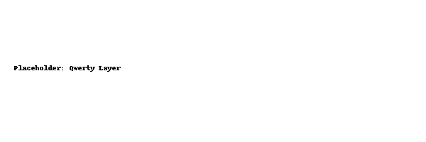
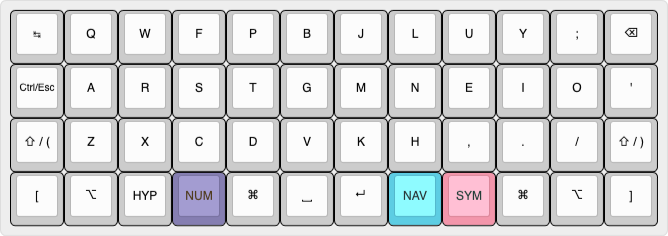
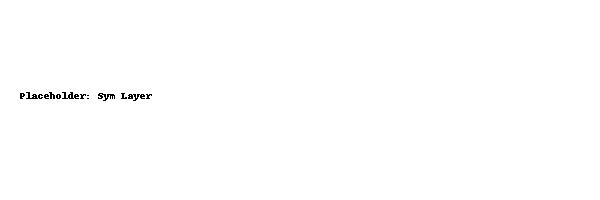
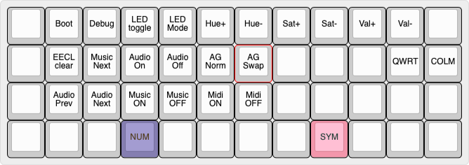

# ⌨️ Planck Rev7 — stphn Layout

[](https://qmk.fm)
[](https://qmk.fm/keyboards/planck/)
[](https://www.gnu.org/licenses/old-licenses/gpl-2.0.html)

Personal QMK layout for my [Planck Rev7](https://qmk.fm/keyboards/planck/) keyboard.  
Managed as a standalone repo with QMK as a git submodule.

---

## 📂 Repo structure

```
planck-layout/
├── keymap/       # my custom layout files (keymap.c, config.h, rules.mk, etc.)
├── qmk/          # QMK Firmware (as submodule)
├── firmware/     # archived .bin builds with timestamp
├── images/       # layout preview images (placeholders provided)
├── Makefile      # build/flash/save shortcuts
└── .gitignore    # keeps the repo clean
```

---

## 🔧 Setup

Clone with submodules:

```bash
git clone --recurse-submodules git@github.com:YOURNAME/planck-layout.git
cd planck-layout
```

If you forgot `--recurse-submodules`:

```bash
git submodule update --init --recursive
```

---

## ⚙️ Commands

### Build only

```bash
make build
```

Compiles the firmware into `qmk/.build/planck_rev7_stphn.bin`.

### Build + Flash

```bash
make flash
```

Compiles and flashes directly to the Planck Rev7  
(put the board in bootloader with RESET/BOOT or `QK_BOOT` key first).

### Build + Save

```bash
make save
```

Compiles and copies a timestamped `.bin` into `firmware/`.

Example:

```
firmware/planck_rev7_stphn-20240909-212055.bin
```

### Clean

```bash
make clean
```

Removes build cache to force a fresh build.

---

## 📝 Notes

- `qmk doctor` can be run to verify your environment.
- To update QMK to the latest upstream:
  ```bash
  cd qmk
  git fetch origin
  git checkout master
  git pull
  cd ..
  git add qmk
  git commit -m "chore: update QMK submodule"
  ```
- Archived firmware in `firmware/` is safe to commit.  
  Build junk inside `qmk/.build/` is ignored via `.gitignore`.

---

## 🎹 Layout Preview

Layer diagrams (placeholders provided in `images/`). Replace with screenshots from [KLE](http://www.keyboard-layout-editor.com/) or [QMK Configurator](https://config.qmk.fm/#/planck/rev7/stphn).

### QWERTY



### Colemak



### Number


### Symbols



### Navigation


### Adjust



---

✨ That’s it — edit your keymap in `keymap/`, run `make flash`, and enjoy your custom layout!
